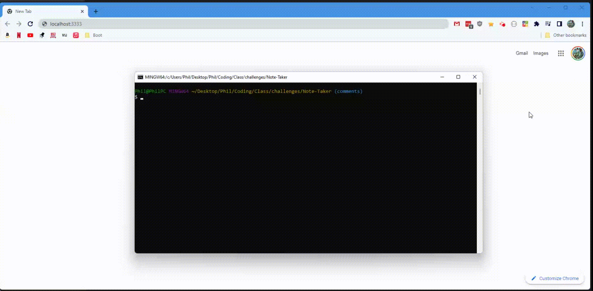

# Note Taker

## Description

This app allows the user to record notes in a server-side database. It also allows the user to delete notes.

---

## Table of Contents

* [Installation](#installation)
* [Usage](#usage)
* [Code Snippets](#code-snippets)
* [Technology](#technology)
* [Credits](#credits)
* [Testing](#testing)
* [License](#license)

---

## Installation

The files for this program can be downloaded [here](https://github.com/pdbesse/Note-Taker/archive/refs/heads/main.zip). 

This app requires node.js to be installed. For download and installation instructions, please see [nodejs.org](https://nodejs.org/en/download/).

This app also requires Crypto, Express, and Nodemon to be installed. To do this, open the terminal and navigate to the extracted folder. Enter: 
```
npm install
```
This will download any modules required for the app to work. Still in the console, enter:
```
npm start
```
This will launch the program.

---

## Usage



Upon running
```
npm start
``` 
The server will start listening on PORT 3333. The user should open their web browser and navigate to 'localhost:3333'. When the user presses the 'Get Started' button, the user will be brought to the Notes page.

Here, the user can enter a title and text for a note. Upon clicking the save button, the note will be saved to the server-side notes database and will populate in the left-hand column. If the user clicks the note, the title and text of the note will populate in the right-hand column.

If the user clicks the delete button, the note will be deleted from the server-side database and will disappear from the page.

---

## Code Snippets

```javascript
const express = require('express');
const fs = require('fs');
const path = require('path');
const notes = require('./db/db.json');
```

The first three lines import the necessary modules to run the application. The fourth line imports the notes database json file.

```javascript
const crypto = require('crypto');
const randNoteID = crypto.randomUUID({ disableEntropyCache: true });
```

These two lines of code import the cryptop module from node. A variable is then created to run the crypto.randomUUI() function, which generates a random id number.

```javascript
app.get('/', (req, res) => {
    res.sendFile(path.join(__dirname, 'public/index.html'));
});
```

This clode block joins the URL path and file path for the index.html file.

```javascript
app.get('/notes', (req, res) => {
    res.sendFile(path.join(__dirname, 'public/notes.html'));
});
```

This code block joins the URL path and file path for the notes.html file.

```javascript
app.get('/api/notes', (req, res) => {
    res.json(notes);
});
```

This code block sets the '/api/notes' URL to return the notes database as a JSON object in the browser.

```javascript
app.post('/api/notes', (req, res) => {
    const { title, text } = req.body;
    const newNote = {
        title,
        text,
        id: randNoteID
    }
    notes.push(newNote);

    fs.writeFile('./db/db.json', JSON.stringify(notes, null, 4), (err) => {
        if (err) {
            console.log(err)
        } else {
            res.json(newNote);
            console.log('New note added');
        };
    });
});
```

This code block allows the user to post a note to the notes database json file. It defines the request body before constructing newNote; notice the random id number is given to the new note via crypto.randomUUID(). The new note is then pushed to the notes database, an array of note objects.

The notes database is then written to './db/db.json', the notes database file.

```javascript
app.delete('/api/notes/:id', (req, res) => {
    fs.readFile(path.join(__dirname, '.db/db.json'), 'utf8', (err, data) => {
        const nixID = req.params.id;

        for (let i = 0; i < notes.length; i++) {
            const nixNote = notes[i];
            if (nixNote.id == nixID) {
                notes.splice([i], 1);
            };
        };
        fs.writeFile(path.join(__dirname, './db/db.json'), JSON.stringify(notes, null, 4), (err) => {
            if (err) {
                console.log(err)
            } else {
                console.log('Note deleted');
            };
        });
        res.json(notes);
    })
});
```

This code block allows the user to delete a saved note from the notes database. It first reads the existing notes database. For every element in the notes database array, it checks to see if the id key has a value equal to the request parameter id. If there is a match, that element is spliced from the notes database array.

The notes database file is the re-written without the deleted note.

---

## Technology

Technology Used:
* [GitHub](https://github.com/)
* [GitBash](https://gitforwindows.org/)
* [Visual Studio Code](https://code.visualstudio.com/)
* [Javascipt](https://www.javascript.com/)
* [node.js](https://nodejs.org/en/)
* [express.js](https://expressjs.com/)
* [File System - node.js](https://nodejs.org/api/fs.html)
* [Nodemon](https://www.npmjs.com/package/nodemon)
* [Crypto](https://nodejs.org/api/crypto.html)

---

## Credits

All coding credited to Phillip Besse.

Websites Referenced:
* [Nodejs.devs - FS](https://nodejs.dev/learn/the-nodejs-fs-module)
* [Nodejs.org - FS.writeFile](https://nodejs.org/dist/latest-v16.x/docs/api/fs.html#fswritefilefile-data-options-callback)
* [Crypto - randomUUID()](https://nodejs.org/api/crypto.html#cryptorandomuuidoptions)
* [Express](https://expressjs.com/)
( [Digital Ocean - __dirname](https://www.digitalocean.com/community/tutorials/nodejs-how-to-use__dirname)
* [MDN Docs - JSON.stringify()](https://developer.mozilla.org/en-US/docs/Web/JavaScript/Reference/Global_Objects/JSON/stringify)

---

## Testing

There are no tests for this app.

---

## License

Phillip Besse's Note Taker is licensed under the [MIT License](https://choosealicense.com/licenses/mit/).

MIT License

Copyright (c) 2022 Phillip Besse

Permission is hereby granted, free of charge, to any person obtaining a copy
of this software and associated documentation files (the "Software"), to deal
in the Software without restriction, including without limitation the rights
to use, copy, modify, merge, publish, distribute, sublicense, and/or sell
copies of the Software, and to permit persons to whom the Software is
furnished to do so, subject to the following conditions:

The above copyright notice and this permission notice shall be included in all
copies or substantial portions of the Software.

THE SOFTWARE IS PROVIDED "AS IS", WITHOUT WARRANTY OF ANY KIND, EXPRESS OR
IMPLIED, INCLUDING BUT NOT LIMITED TO THE WARRANTIES OF MERCHANTABILITY,
FITNESS FOR A PARTICULAR PURPOSE AND NONINFRINGEMENT. IN NO EVENT SHALL THE
AUTHORS OR COPYRIGHT HOLDERS BE LIABLE FOR ANY CLAIM, DAMAGES OR OTHER
LIABILITY, WHETHER IN AN ACTION OF CONTRACT, TORT OR OTHERWISE, ARISING FROM,
OUT OF OR IN CONNECTION WITH THE SOFTWARE OR THE USE OR OTHER DEALINGS IN THE
SOFTWARE.

---